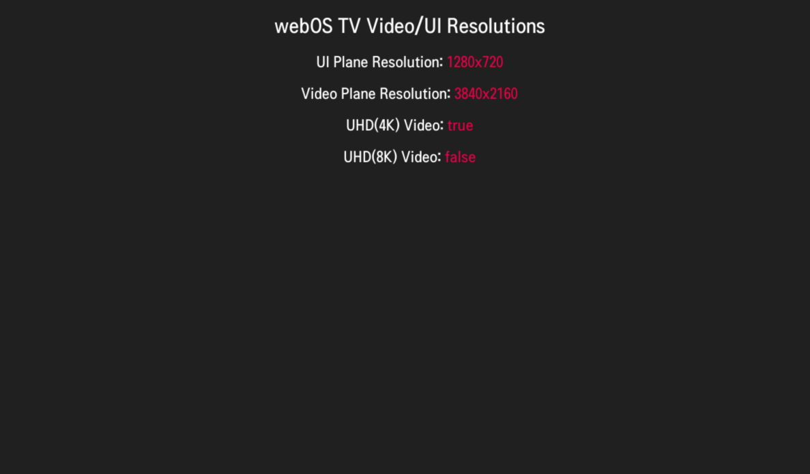

# Resolution
webOS TV provides UI plane resolution for graphics display and video plane resolution for video playback separately. This sample app shows how to get the values for UI plane resolution and for video plane resolution.
For more information, see [Supported App Resolution](https://webostv.developer.lge.com/develop/specifications/app-resolution).

## How to get the resolution
### UI Plane Resolution
UI plane resolution is the resolution for graphics display. UI plane resolution is defined as the [resolution](https://webostv.developer.lge.com/develop/references/appinfo-json#resolution) value of appinfo.json and is also called app resolution.
To get the app resolution in web app, use `window.innerWidth` and `window.innerHeight` properties. 

### Video Plane Resolution
To get the video playback resolution, use `screenWidth` and `screenHeight` properties of [deviceInfo()](https://webostv.developer.lge.com/develop/references/webostvjs-webos#deviceinfo) method in webOSTV.js library.

## Result in the webOS TV
You can install the sample app and see the sample app result in the webOS TV as in the following image.
